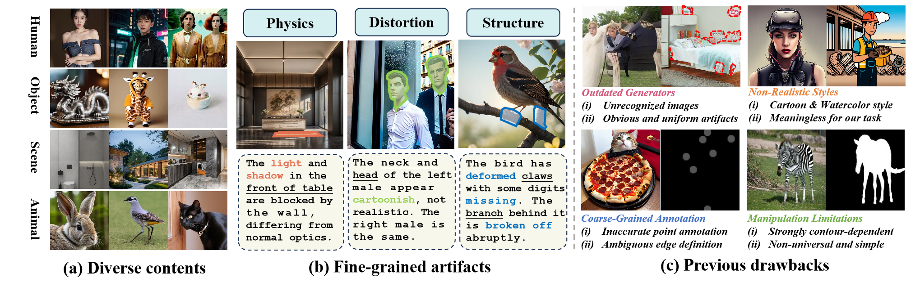
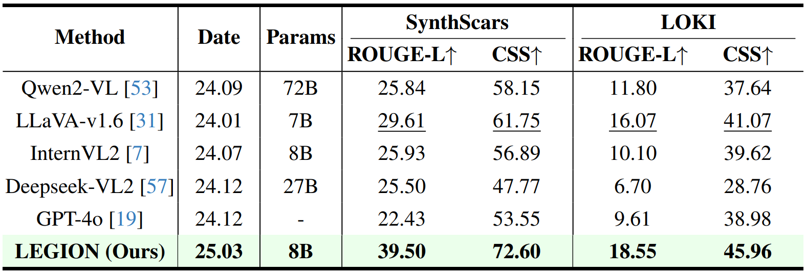
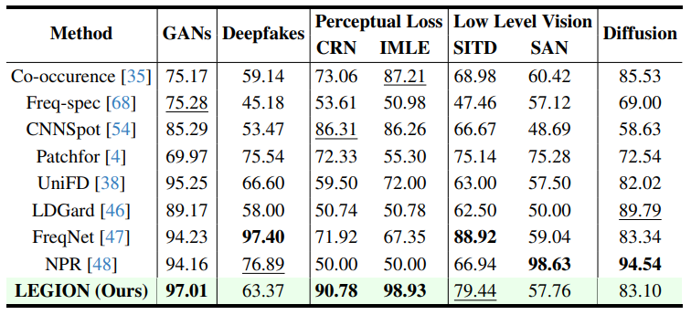

<div align="center">
<h2> LEGION: Learning to Ground and Explain for Synthetic Image Detection
</h2> 
<div align="center">

[Hengrui Kang](https://scholar.google.com/citations?user=kVbzWCAAAAAJ&hl=zh-CN)\*, [Siwei Wen](https://openreview.net/profile?id=~Siwei_Wen5)\*, [Zichen Wen](https://scholar.google.com/citations?user=N-aPFvEAAAAJ&hl=zh-CN)\*, [Junyan Ye](https://yejy53.github.io/), [Weijia Li](https://liweijia.github.io/)<sup>†</sup><br>[Peilin Feng](https://peilin-ff.github.io/), [Baichuan Zhou](https://baichuanzhou.github.io/), [Bin Wang](https://wangbindl.github.io/), [Dahua Lin](http://dahua.site/), [Linfeng Zhang](http://www.zhanglinfeng.tech/), [Conghui He](https://conghui.github.io/)<sup>†</sup>

</div>
<a href="https://arxiv.org/pdf/2503.15264" target="_blank"></a>&nbsp;&nbsp;&nbsp;&nbsp;
<a href="https://opendatalab.github.io/LEGION/" target="_blank"></a>&nbsp;&nbsp;&nbsp;&nbsp;
<a href='https://github.com/opendatalab/LEGION'></a>
</div>

<!-- <div align="center">
  <p align="center">
    <a href=''>
       </a>
  </p>
</div> -->

## 📢 Latest News
- **[2025.3.21]**: 🔥 Now, **SynthScars dataset is available** on HuggingFace. Click [here](https://github.com/opendatalab/LEGION) to download it.
- **[2025.3.20]**: 🔥 We have released our paper on arXiv. Check out the paper [here](https://github.com/opendatalab/LEGION).

##  &nbsp;Overview

The rapid advancements in generative technology have emerged as a double-edged sword. While offering powerful tools that enhance convenience, they also pose significant social concerns. As **defenders**, current synthetic image detection methods often lack artifact-level textual interpretability and are overly focused on image manipulation detection, and current datasets usually suffer from outdated generators and a lack of fine-grained annotations. In this paper, we introduce **SynthScars**, a high-quality and diverse dataset consisting of 12,236 fully synthetic images with human-expert annotations. It features 4 distinct image content types, 3 categories of artifacts, and fine-grained annotations covering pixel-level segmentation, detailed textual explanations, and artifact category labels. Furthermore, we propose **LEGION** (**LE**arning to **G**round and explain for Synthetic **I**mage detecti**ON**), a multimodal large language model (MLLM)-based image forgery analysis framework that integrates artifact detection, segmentation, and explanation. Building upon this capability, we further explore LEGION as a controller, integrating it into image refinement pipelines to guide the generation of higher-quality and more realistic images. Extensive experiments show that LEGION outperforms existing methods across multiple benchmarks, particularly surpassing the second-best traditional expert on SynthScars by **3.31%** in mIoU and **7.75%** in F1 score. Moreover, the refined images generated under its guidance exhibit stronger alignment with human preferences. The code, model, and dataset will be released.

<div align="center">

</div>

## 🏆 Contribution

- We introduce **SynthScars**, a **challenging dataset** for synthetic image detection, featuring high-quality synthetic images with diverse content types, as well as fine-grained pixel-level artifact annotations with detailed textual explanations.
- We propose **LEGION**, a comprehensive **image forgery analysis framework** for artifact localization, explanation generation, and forgery detection, which effectively aids human experts to detect and understand image forgeries.
- Extensive experiments demonstrate that LEGION achieves **exceptional performance** on **4** challenging benchmarks. Comparisons with **19** existing methods show that it achieves SOTA performance on majority of metrics, exhibiting strong **robustness** and **generalization** ability.
- We position LEGION not only as a **defender** against ever-evolving generative technologies but also as a **controller** that guides **higher-quality and more realistic image generation**.


## 🛠️ Installation
Please clone our repository and change directory to the folder:
```bash
git clone git@github.com:opendatalab/LEGION.git
cd LEGION
```

Our model is based on the [GLaMM](https://github.com/mbzuai-oryx/groundingLMM/blob/main/docs/install.md) environment. Please follow the steps below to configure the environment.
```bash
conda create -n legion python=3.10
conda activate legion
pip install -r requirements.txt

# Install mmcv
git clone https://github.com/open-mmlab/mmcv
cd mmcv
git checkout v1.4.7
MMCV_WITH_OPS=1 pip install -e .
```

## 📦 Dataset

<div align="center">

</div>

**SynthScars** is a high-quality and diverse dataset consisting of **12,236** fully synthetic images with human-expert annotations. It features **4** distinct image content types, **3** categories of artifacts, and fine-grained annotations covering **pixel-level segmentation**, **detailed textual explanations**, and **artifact category labels**.  Please download it from [HuggingFace](), unzip it into the `./data` folder, and ensure it follows the structure below:
```
./data
└── SynthScars
    ├── train
    │   ├── images
    │   │   ├── xxx.jpg
    │   │   └── ...
    │   └── annoations
    │       └── train.json
    └── test
        ├── images
        │   ├── xxx.jpg
        │   └── ...
        └── annoations
            └── test.json
```


## 📌 Usage
As a **defender**, we provide the training and evaluation code for the image forgery analysis task as follows:

- ###  Localization and &nbsp; Explanation
  If you want to train LEGION to perform artifact localiztion and explanation generation, please first download the pretrained weights of [GLaMM](https://huggingface.co/MBZUAI/GLaMM-GranD-Pretrained) & [SAM](https://huggingface.co/spaces/abhishek/StableSAM/blob/main/sam_vit_h_4b8939.pth), and then run:
  ```bash
    bash train_loc_exp.sh
  ```
  After training, you need to merge the weights as follows:
  ```bash
    bash merge_step1.sh
    bash merge_step2.sh
  ```
  If you want to infer on your data, please put them into one folder and then run:
  ```bash
    bash infer_loc_exp.sh
  ```
- ###  Detection
  If you want to train LEGION to conduct deepfake detection, **please replace the data path and model path** in the bash file and run:
  ```bash
    bash train_cls.sh
  ```
  If you want to eval on your data, please run:
  ```bash
    bash eval_cls.sh 
  ```

As a **controller**, we provide the pipelines of both image regeneration and inpainting for high-quality and more realistic image generation:

- ### Regeneration
  You can run iteratively prompt revision and image regeneration via:
  ```bash
    conda create -n legion_regenerate python=3.10 -y
    conda activate legion_regenerate
    pip install -r requirements_regenerate.txt
    bash legion_regenerater.sh
  ```
- ### Inpainting
  You can run iteratively regional inpainting via:
  ```bash
    bash legion_inpainter.sh
  ```
  


## 📊 Performance
As a **defender**, we evaluate LEGION's performance on three key subtasks: **artifact localization**, **explanation generation**, and **deepfake detection**. 
- ###  Localization
    We evaluate the artifact localization task using the **SynthScars**, **RichHF-18K**, and **LOKI** datasets, which contain <u>region-level mask</u> annotations.
<div align="center">

</div>

- ###  Explanation 
    To assess the model's natural language interpretability, we use the **SynthScars** and **LOKI** datasets, which provide <u>detailed artifact explanations</u>.
<div align="center">

</div>

- ###  Detection
    For the deepfake detection task, we adopt the classic **UniversialFakeDetect** benchmark.
<div align="center">

</div>

As a **controller**, we explore LEGION's capability to guide image generation through two pipelines: image **regeneration** and **inpainting**, based on its analytical feedback.
<div align="center">

</div>

**Note**: More visualization results and case studies please refer to our [Project Page](https://opendatalab.github.io/LEGION/).

## 😄 Acknowledgement

This repository is built upon the work of [GLaMM](https://github.com/mbzuai-oryx/groundingLMM). We appreciate their contributions and insights that have provided a strong foundation for our research.


## 📜 Citation
If you find our work interesting and helpful, please consider giving our repo a star. Additionally, if you would like to cite our work, please use the following format:
```bibtex
@misc{kang2025legionlearninggroundexplain,
      title={LEGION: Learning to Ground and Explain for Synthetic Image Detection}, 
      author={Hengrui Kang and Siwei Wen and Zichen Wen and Junyan Ye and Weijia Li and Peilin Feng and Baichuan Zhou and Bin Wang and Dahua Lin and Linfeng Zhang and Conghui He},
      year={2025},
      eprint={2503.15264},
      archivePrefix={arXiv},
      primaryClass={cs.CV},
      url={https://arxiv.org/abs/2503.15264}, 
}
```
